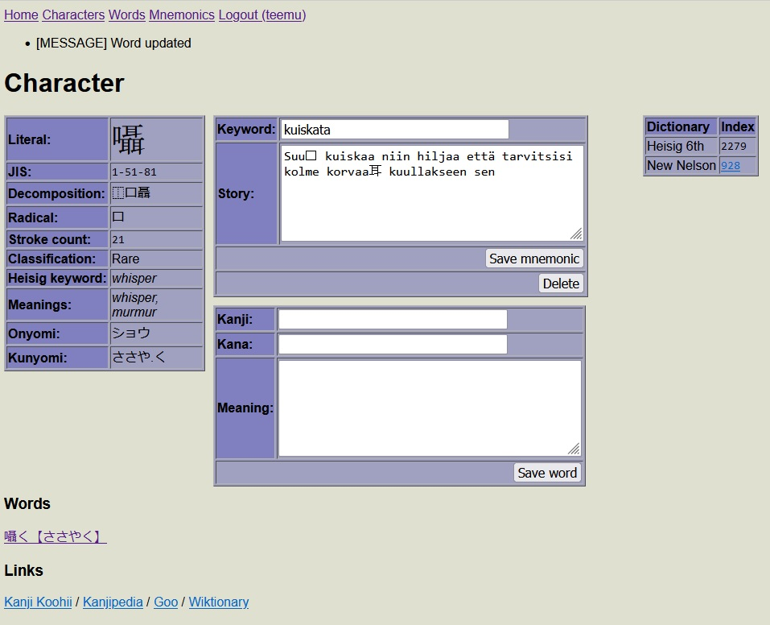

# JP-DATA

Flask webserver with a simple UI for managing kanji mnemonics and words.

## Features

* Supports multiple users
* Kanji information from [KANJIDIC](http://www.edrdg.org/wiki/index.php/KANJIDIC_Project)
* Kanji decomposition data from [Kanji Database](https://kanji-database.sourceforge.net/)
* Remembering the Kanji keywords from [heisig-kanjis](https://github.com/sdcr/heisig-kanjis)
* Written in pure Python and Jinja2, no Javascript required!

## Screenshots

