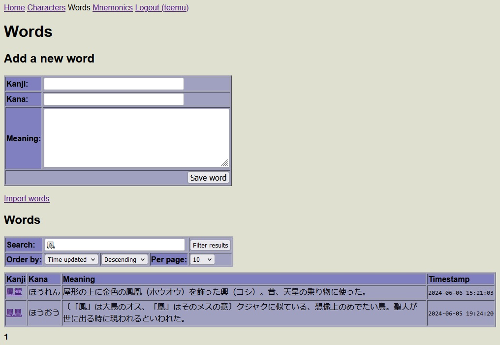

# JP-DATA

Flask webserver with a simple UI for managing kanji mnemonics and words.

## Features

* Supports multiple users
* Kanji information from [KANJIDIC](http://www.edrdg.org/wiki/index.php/KANJIDIC_Project)
* Kanji decomposition data from [Kanji Database](https://kanji-database.sourceforge.net/)
* Remembering the Kanji keywords from [heisig-kanjis](https://github.com/sdcr/heisig-kanjis)
* Written in pure Python and Jinja2, no Javascript required!

## Screenshots

[](screenshot_character.jpg)
[](screenshot_words.jpg)

## Installation

Create a .env file at the project root and fill in the following values

```
SECRET_KEY=

POSTGRES_USER=
POSTGRES_PASSWORD=
POSTGRES_HOST=
POSTGRES_PORT=
POSTGRES_DB=jpdata
```

To start the server

```bash
$ docker compose up --build -d
```

To initialize the database

```bash
$ docker exec jpdata-web-1 flask character insert
$ docker exec jpdata-web-1 flask decomp insert
$ docker exec jpdata-web-1 flask heisig insert
```
